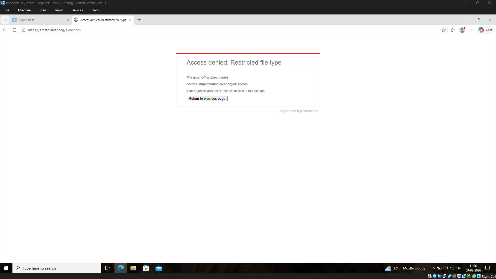
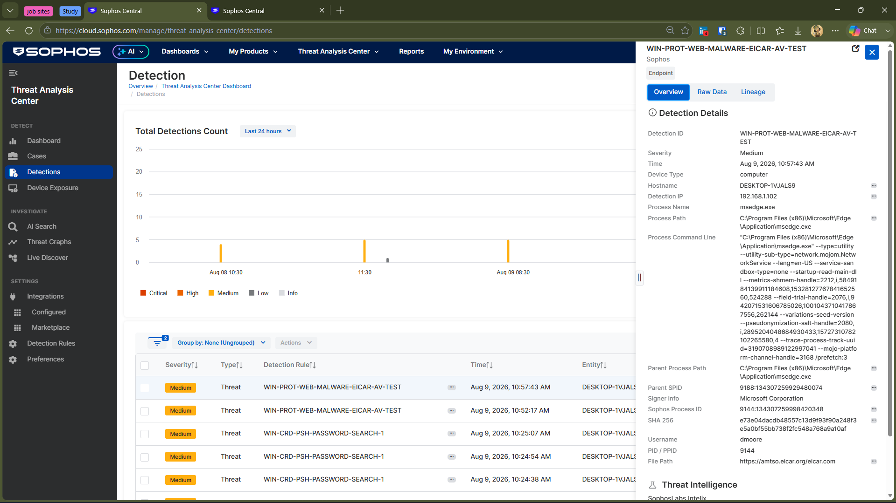
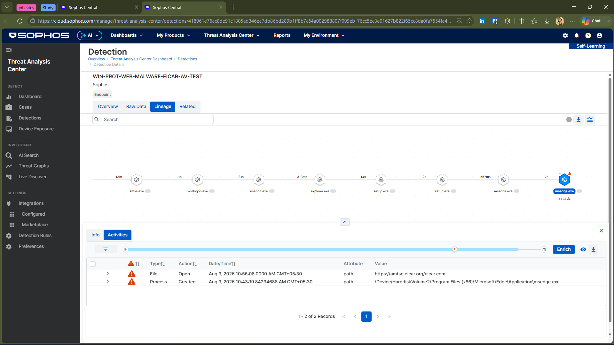
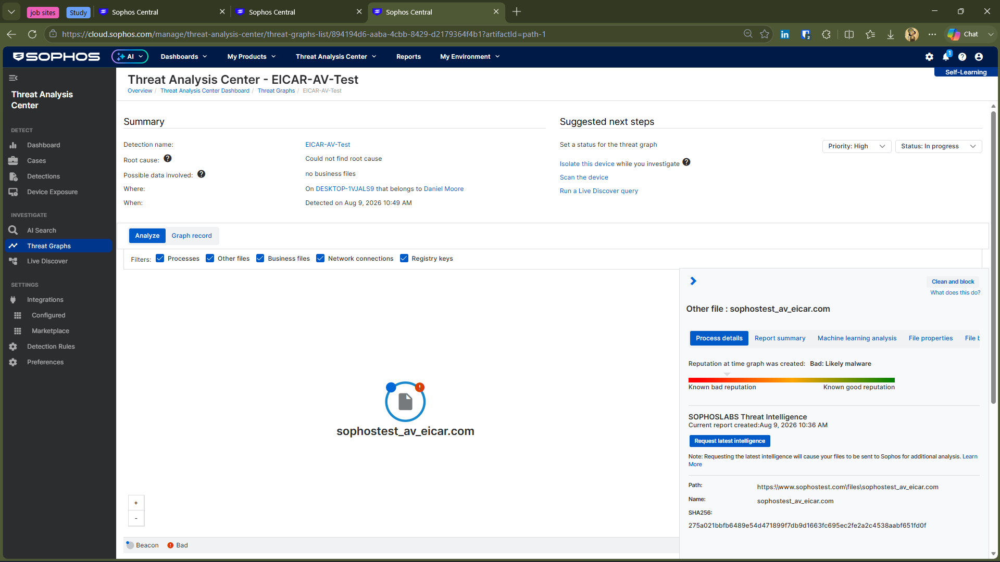

# 🛡️ Investigation 01 — EICAR Web & Endpoint Detection

A controlled endpoint security investigation using the **EICAR antivirus test file** to examine how Sophos protects a Windows endpoint and provides investigation visibility through Sophos Central.

> ⚠️ Lab Disclaimer:
This investigation was performed in an isolated lab environment using the harmless EICAR antivirus test file. No real malware was used.

## 🎯 Objective

The objective of this investigation was to understand how **Sophos Endpoint** protects a Windows endpoint and how Sophos Central supports the detection and investigation of a security event.

Using the harmless EICAR antivirus test file, the investigation explored Sophos **Web Protection, Endpoint Detection, Process Lineage, and Threat Graph** to understand how different security controls contribute to detection and investigation.

The goal was not simply to verify that Sophos could detect EICAR, but to understand **how the protection layers respond, what telemetry they provide, and how an analyst can investigate the resulting event in Sophos Central.**

---

## 🧪 Test Environment

- **Endpoint:** Windows 10
- **Security Platform:** Sophos Endpoint
- **Management:** Sophos Central
- **Test File:** EICAR antivirus test file
- **Test Source:** AMTSO EICAR test page
- **User Context:** Windows user account

---

## 🔎 Investigation

### 1. Web Protection

The EICAR test file was accessed from the protected Windows endpoint.

Sophos Web Protection blocked access to the file and displayed:

> **Access denied — Restricted file type**

The event demonstrated that Sophos can prevent potentially dangerous file types from being accessed through the web before they are successfully downloaded to the endpoint.

---

### 2. Sophos Central Detection

Sophos Central recorded the activity as an endpoint threat detection.

**Detection observed:**

- **Detection:** `WIN-PROT-WEB-MALWARE-EICAR-AV-TEST`
- **Severity:** Medium
- **Process:** `msedge.exe`
- **Endpoint:** Windows 10

---

### 3. Process Lineage

The detection was investigated through Sophos process lineage to understand the activity surrounding the event.

The lineage showed the browser activity and the associated EICAR file activity, providing additional context about how the detection occurred.

---

### 4. Threat Graph

The detection was opened in Sophos Threat Graph to investigate the event in greater detail.

The graph identified the EICAR test file with a **bad reputation / likely malware** classification and provided additional file information and response options.

---

## 🛡️ Security Controls Demonstrated

| Control | What was observed |
|---|---|
| Web Protection | Blocked access to the restricted EICAR file |
| Endpoint Detection | Generated a detection in Sophos Central |
| Process Lineage | Provided context around the browser and file activity |
| Threat Graph | Connected the detection with additional file and process context |
| Threat Response | Sophos provided response options for the detected threat |

---

## 💡 Key Takeaways

- Sophos can provide protection at multiple stages of a web-based file event.
- Web Protection can prevent access to restricted or potentially dangerous content.
- Sophos Central provides centralized visibility into endpoint detections.
- Process lineage helps investigate how an event originated.
- Threat Graph provides additional context for understanding and investigating a detection.
- The investigation showed how prevention and endpoint telemetry can work together rather than relying on a single security control.

---

## ✅ Conclusion

The EICAR test demonstrated how Sophos can provide a layered endpoint protection and investigation workflow:

**Web Protection → Endpoint Detection → Process Investigation → Threat Graph Analysis**

The investigation showed that Sophos Central provides more than a simple detection result. It provides security telemetry and investigation context that can help an analyst understand what happened, how the activity was connected, and what response options are available.
