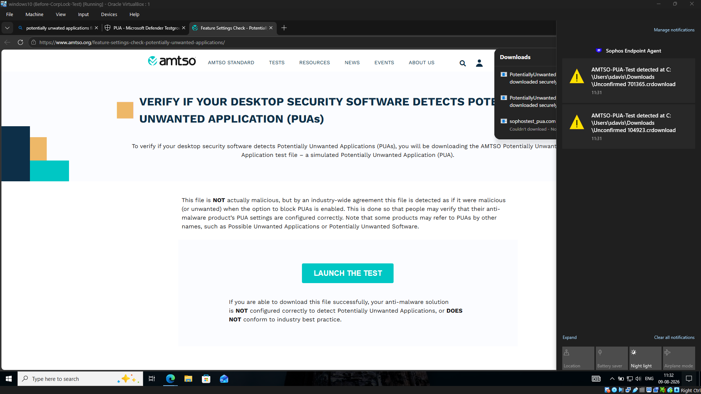
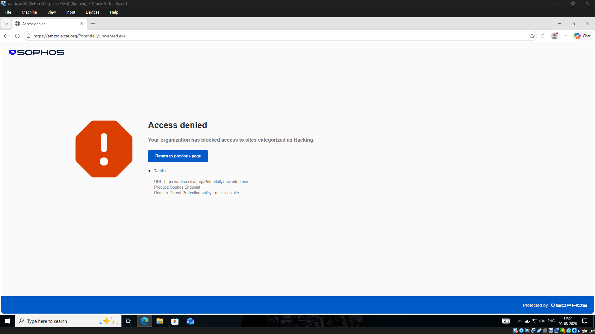
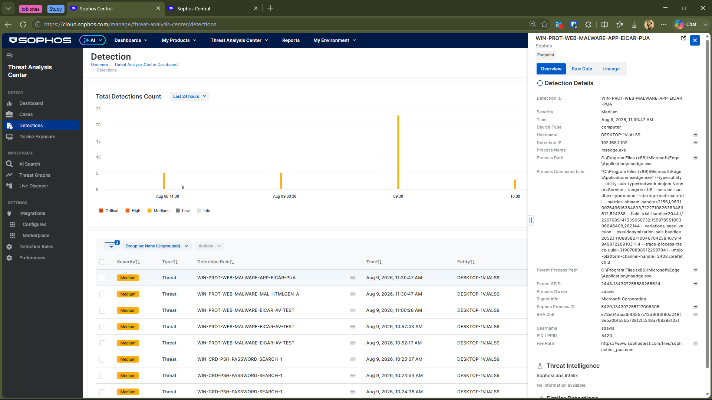
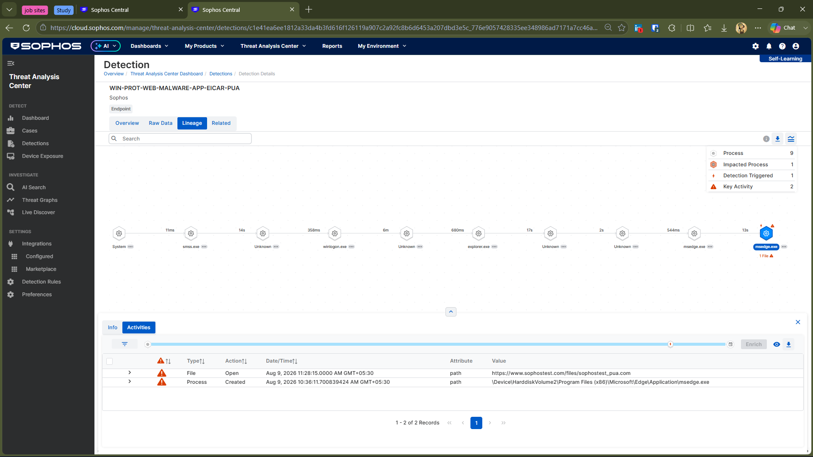

# 🛡️ Investigation 02 — PUA Detection & Investigation

A controlled endpoint security investigation using the AMTSO Potentially Unwanted Application (PUA) test to understand how **Sophos Endpoint** identifies and responds to potentially unwanted software activity on a Windows endpoint.

> ⚠️ **Lab Disclaimer**
>
> This investigation was performed in an isolated lab environment using the harmless AMTSO PUA test file. The test file is not actually malicious and was specifically designed to safely validate security product PUA detection capabilities.

---

## 🎯 Objective

The objective of this investigation was to understand how Sophos Endpoint handles Potentially Unwanted Applications (PUAs) and how the resulting security activity can be investigated through Sophos Central.

The investigation focused on Sophos Web Protection, PUA detection, endpoint telemetry, and Process Lineage to understand what evidence was available during the investigation.

The goal was not simply to confirm that Sophos could detect a PUA test, but to understand how the protection controls responded and what information was available to an analyst after the event.

---

## 🧪 Test Environment

- **Endpoint:** Windows 10
- **Security Platform:** Sophos Endpoint
- **Management Platform:** Sophos Central
- **Test Standard:** AMTSO PUA Test
- **Test Type:** Potentially Unwanted Application
- **User Context:** Standard Windows user
- **Environment:** Isolated home lab

---

## 🔎 Investigation

### 1. AMTSO PUA Test

The AMTSO Potentially Unwanted Application test page was accessed from the protected Windows endpoint. The test was used to safely validate whether Sophos could identify and protect against potentially unwanted application activity.

Sophos generated security notifications when the PUA test activity was accessed/downloaded.

*AMTSO PUA test activity generated Sophos security notifications on the protected endpoint.*

---

### 2. Sophos Web Protection

Sophos Web Protection blocked access to the PUA test content. The browser displayed an Access Denied page, indicating that the requested content was blocked by the configured protection policy before the test content could be successfully delivered to the endpoint.

This demonstrated that protection occurred at the web access stage, before the test content could proceed further.

*Sophos Web Protection blocked access to the PUA test content.*

---

### 3. Sophos Central Detection

Sophos Central recorded the activity as an endpoint detection.

**Detection evidence:**

- **Detection:** `WIN-PROT-WEB-MALWARE-APP-EICAR-PUA`
- **Severity:** Medium
- **Process:** `msedge.exe`
- **Endpoint:** Windows 10

The detection provided additional endpoint context, including the process responsible for accessing the test content.

*Sophos Central generated an endpoint detection associated with the PUA test activity.*

---
## 📊 Threat Graph Availability

A Threat Graph was not generated for this PUA detection.

This was an important investigation finding because detection visibility and Threat Graph availability are not the same thing.

The detection still provided useful investigation data, including the detection rule, affected endpoint, process information, and other available telemetry.

📌 **Investigation note:** The absence of a Threat Graph does not mean the activity was not detected. Threat Graph availability can vary depending on the detection type and the telemetry available for that event.

---

### 4. Detection Lineage

The detection's Lineage view was reviewed to understand the process and file activity associated with the PUA event.

The Lineage showed `msedge.exe` accessing the AMTSO test content and provided additional context around the activity that triggered the detection.

**Analyst purpose:** The goal was to determine how the detected activity originated and what process context was available for further investigation.

*Process Lineage provided additional context around the browser process associated with the PUA detection.*

---

## 🧠 Analyst Assessment

The evidence showed a clear progression from the attempted access to the PUA test content through web protection, endpoint detection, and process investigation.

**Investigation context:**

> PUA test activity → Web Protection blocked access → Endpoint Detection generated → Process Lineage provided process context

The activity was expected test activity performed in a controlled lab environment. The investigation therefore focused on validating how Sophos identified, recorded, and exposed the activity for analyst investigation rather than treating the event as a real-world malicious incident.

A Threat Graph was not available for this detection, but the available detection and Lineage data still provided sufficient context to understand the activity and the process involved.

---

## 🛡️ Security Controls Demonstrated

| Control | What was observed |
|---|---|
| Web Protection | Blocked access to the PUA test content |
| PUA Detection | Generated a PUA-related endpoint detection |
| Endpoint Telemetry | Captured the browser process and related activity |
| Process Lineage | Provided context around the activity that triggered the detection |
| Sophos Central | Centralized the detection and investigation information |

---

## 💡 Key Takeaways

- A PUA detection can provide useful investigation context even when a Threat Graph is not available.
- Web Protection and endpoint detection provided different pieces of evidence around the same activity.
- Process Lineage helped connect the detection to the browser activity that triggered it.
- 
---

## ✅ Conclusion

This investigation demonstrated how Sophos handled a controlled PUA test across web protection, endpoint detection, and process investigation.

The workflow observed during the test was:

**Web Protection → PUA Detection → Endpoint Telemetry → Process Lineage → Investigation**

The investigation also showed that not every detection provides the same investigation views. In this case, Process Lineage was available while a Threat Graph was not. The main takeaway was that useful investigation context can still be available even when a specific investigation view is unavailable.
