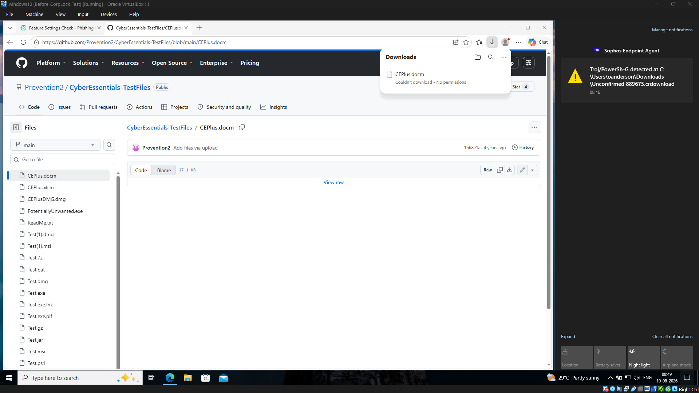
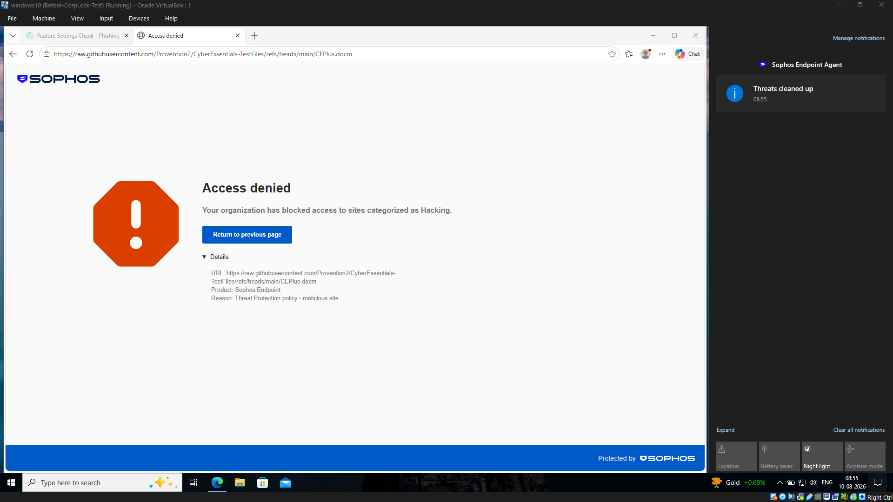
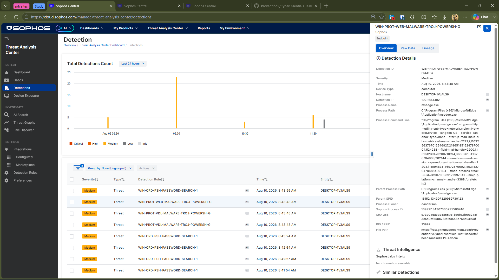
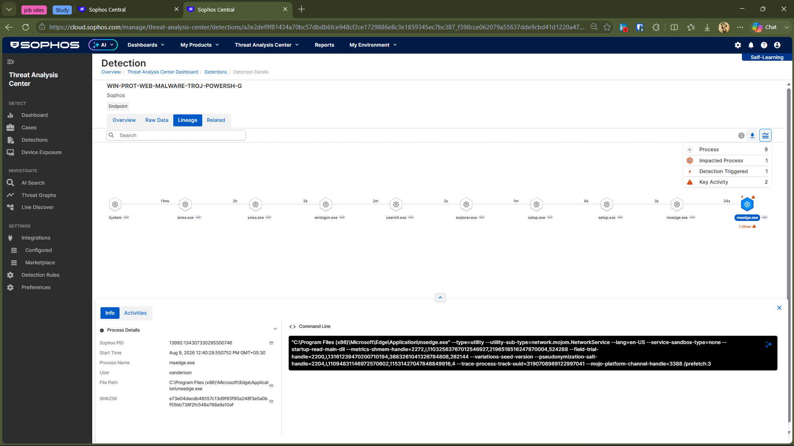

# Investigation 03 — DOCM Web Protection & Detection

A controlled endpoint security investigation using a DOCM security test file to understand how Sophos Web Protection and Sophos Endpoint respond to potentially malicious web-based content and how the resulting activity appears within Sophos Central.

> ⚠️ **Lab Disclaimer**
>
> This investigation was performed in an isolated lab environment using a security test file from the Cyber Essentials test-file repository. The file was used only to safely validate Sophos protection and detection behavior and was not treated as real-world malware.

---

## 🎯 Objective

The objective of this investigation was to understand how Sophos handles a DOCM test file accessed through a web-based source and how the resulting security activity is represented within Sophos Central.

The investigation focused on Sophos Web Protection, endpoint threat detection, endpoint telemetry, and process lineage to understand how multiple protection and investigation capabilities responded to the same controlled security test.

The goal was not simply to confirm that Sophos blocked or detected the test content, but to understand how Sophos layered its protection mechanisms and what investigation context was available to an analyst.

---

## 🧪 Test Environment

- **Endpoint:** Windows 10
- **Security Platform:** Sophos Endpoint
- **Management Platform:** Sophos Central
- **Test File:** `CEPlus.docm`
- **Test Source:** Cyber Essentials Test Files
- **Environment:** Isolated home lab

---

## 🔎 Investigation

### 1. DOCM Test File

The `CEPlus.docm` test file was accessed from the Cyber Essentials security testing repository.

The test was performed to observe how Sophos handled the attempted web-based access and what security controls were triggered during the activity.

---

### 2. Sophos Web Protection

Sophos Web Protection blocked access to the DOCM test content during the web-based access attempt.

The browser displayed an **Access denied** page indicating that the requested content was blocked under the configured Sophos threat protection policy.

The same evidence also shows a Sophos Endpoint notification indicating that the detected threat activity was cleaned up.

This demonstrated that Sophos could intervene at the web-access stage while also providing endpoint protection and remediation when the test activity was detected.

---

### 3. Sophos Central Detection

Sophos Central recorded the activity as an endpoint threat detection.

The detection provided additional endpoint context, including:

- **Detection:** `WIN-PROT-WEB-MALWARE-TROJ-POWERSH-G`
- **Severity:** Medium
- **Process:** `msedge.exe`
- **Endpoint:** Windows 10

The detection details also provided information such as the process path, process command line, parent process information, SHA-256, and the source file path.

This provided a centralized view of the security event and the endpoint activity associated with the detection.

---

## 📊 Threat Graph Availability

A Threat Graph was not generated for this DOCM-related detection.

Sophos still provided investigation data through the detection details and **Process Lineage** view. The lineage information was used to examine the process activity associated with the detected content and understand the execution context.

This investigation showed that **Threat Graph availability and detection visibility are not the same thing**. A detection can provide useful telemetry and investigation context even when a Threat Graph is not available.

> 🔎 **Investigation note:** The absence of a Threat Graph does not indicate that Sophos failed to detect the activity. In this case, the available Process Lineage view provided the relevant investigation context.

---

### 4. Detection Lineage

The detection's **Lineage** view was reviewed to understand the process activity associated with the event.

The lineage showed the sequence of processes leading to the detected activity and provided additional endpoint context around the process responsible for accessing the test content.

The lineage was useful for moving beyond the detection itself and examining the process context associated with the event.

---

## 5. Investigation Findings

The investigation showed that Sophos provided multiple layers of protection during the DOCM test.

The attempted access to the test content was blocked by Sophos Web Protection, while Sophos Endpoint generated detection telemetry for the related activity.

The available detection and Process Lineage information provided additional context for reviewing the event and understanding the associated process activity.

---

## 🛡️ Security Controls Demonstrated

| Control | What was observed |
|---|---|
| Web Protection | Blocked access to the DOCM test content |
| Endpoint Detection | Generated a detection for the related activity |
| Endpoint Telemetry | Captured process and related activity associated with the detection |
| Process Lineage | Provided additional context around the detected activity |
| Sophos Central | Centralized detection and investigation information |
| Remediation | Sophos cleaned up the detected threat activity |

---

## 💡 Key Takeaways

- Sophos Web Protection can block access to suspicious or security-testing content before it is successfully delivered.
- Endpoint detection can provide additional visibility when related activity is observed on the endpoint.
- Process Lineage can help an analyst understand the process context associated with a detection.
- A Threat Graph is not necessarily available for every detection; available investigation views can vary by event.
- Sophos Central brings protection and investigation information together in a centralized workflow.
- The investigation demonstrated how multiple protection and visibility capabilities can work together rather than relying on a single security mechanism.

---

## ✅ Conclusion

This investigation demonstrated how Sophos handled a controlled DOCM-based web protection test.

The workflow observed during the investigation was:

**Web Protection → Endpoint Detection → Endpoint Telemetry → Process Lineage → Remediation**

The test provided a practical view of how Sophos combines prevention, detection, investigation visibility, and remediation within Sophos Central.

It also demonstrated that the investigation information available to an analyst can vary between detections, with Process Lineage providing useful context in this case even though a Threat Graph was not generated.
