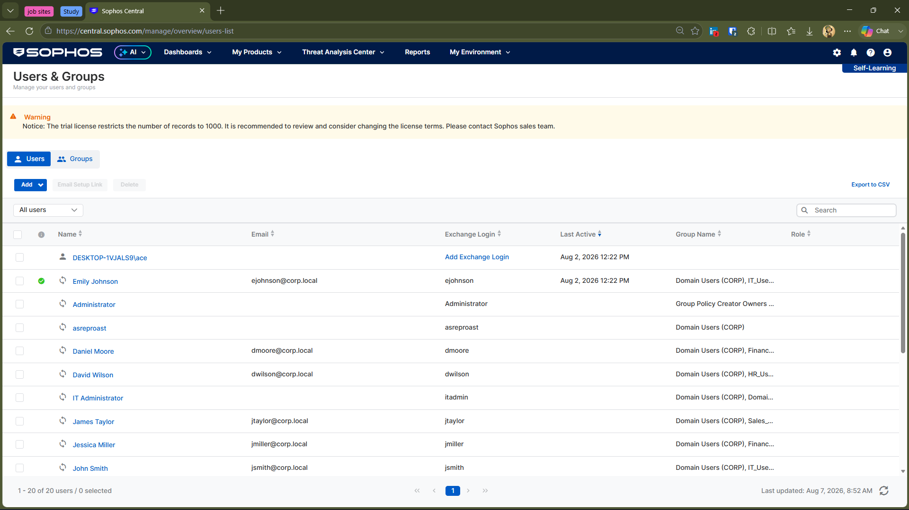

# 🛡️ Sophos Endpoint SOC Investigation Lab

A practical security investigation lab focused on understanding how **Sophos Endpoint and Sophos Central** detect, investigate, and respond to suspicious activity on Windows endpoints.

This project was built to go beyond simply generating detections. The goal was to understand how Sophos connects **endpoint protection, identity context, detection telemetry, investigation, and response** within a centralized security platform.

---

## 🎯 Lab Objective & Scope

The objective of this lab was to understand the Sophos security workflow from an analyst's perspective.

Rather than treating Sophos as only an endpoint antivirus product, I explored how its different security capabilities work together during an investigation.

The lab covered endpoint protection, web protection, Active Directory identity context, detection investigation, Process Lineage, remediation, and broader attack-level visibility through Sophos Central.

---

## 🏗️ Lab Architecture

## 🧰 Tools & Technologies

| Category | Used |
|---|---|
| Endpoint Security | Sophos Endpoint |
| Security Platform | Sophos Central |
| Identity | Active Directory, AD Sync |
| Endpoint | Windows 10 |
| Testing | Controlled security test files and scenarios |

---
## 🔎 Investigation Approach

The investigations followed a simple SOC-oriented workflow:

**Test Activity → Protection → Detection → Investigation → Process Context → Remediation**

Rather than stopping at the initial detection, I reviewed the available evidence in Sophos Central to understand:

- What activity occurred
- Which endpoint and user were involved
- What Sophos detected
- What process or file was associated with the activity
- What investigation telemetry was available
- What protection or remediation action occurred

The exact investigation path varied depending on the activity and the telemetry available for that event.

## 🧠 What I Learned About Sophos

Before this lab, I mainly viewed endpoint security from the perspective of individual detections.

Working with Sophos helped me understand a broader workflow:

**Protection → Detection → Investigation → Response**

Sophos Central acts as the central point where endpoint activity, detections, alerts, investigation data, and response actions can be viewed together.

One of the biggest things I learned was that **a security platform is not just about detecting a file or process**. The investigation context around that activity is equally important to an analyst.

For example, a detection can provide information such as:

- Affected endpoint
- User associated with the activity
- Process information
- File information
- Detection rule
- Process Lineage
- Remediation status

This helped me look at endpoint security more from an **investigation and SOC workflow perspective** rather than simply asking whether something was detected.

---

## 🆚 Sophos vs CrowdStrike Falcon

I had previously worked with **CrowdStrike Falcon**, so using Sophos gave me a useful opportunity to compare how two endpoint security platforms present security activity.

The biggest difference I noticed was not simply whether a threat was detected, but **how the platforms organize and expose the investigation data**.

With Falcon, I explored endpoint detections and investigated activity generated through controlled techniques such as PowerShell, scheduled tasks, and credential-access testing.

With Sophos, I spent more time exploring the relationship between:

**Web Protection → Endpoint Detection → Detection Details → Process Lineage → Remediation**

Sophos also gave me a different perspective on how security platforms separate concepts such as **events, alerts, detections, and cases**.

The experience helped me understand that different EDR/XDR platforms may achieve similar security goals while presenting the investigation workflow differently.

---

## 🔎 Events, Alerts, Detections & Cases

One of the concepts I explored during the lab was how Sophos separates different types of security information within Sophos Central.

| Concept | Purpose |
|---|---|
| 📝 **Event** | Individual security activity or telemetry generated by an endpoint |
| 🔔 **Alert** | A notification that something requires attention |
| 🚨 **Detection** | Security activity identified by Sophos as suspicious or malicious |
| 📂 **Case** | A higher-level investigation container used to group related security activity |

These concepts are related, but they are not interchangeable.

An endpoint can generate a large amount of telemetry without every individual event becoming an alert or detection.

A detection represents activity that Sophos has identified as security-relevant, while an alert provides a notification or higher-level indication requiring attention.

Cases provide an additional investigation layer when multiple related security events or detections need to be handled together.

### Why the investigations focused on detections and telemetry

The individual investigations in this project primarily focused on **detections and the telemetry surrounding them**, rather than attempting to document every event generated by the endpoint.

This was intentional.

For a SOC analyst, the useful question is not simply:

> "What happened on the endpoint?"

It is also:

> "What did the security platform identify, what evidence did it provide, and how can I investigate it?"

That distinction became much clearer while working with Sophos Central.

---

## 👥 Identity & Active Directory Context

The lab included an Active Directory environment with domain users and groups that were synchronized with Sophos Central using AD Sync.

The Windows endpoint was associated with the domain environment, allowing user and group information to appear alongside endpoint security activity.

For the controlled investigations, activity was performed under domain-user accounts within the lab environment. This allowed the investigations to consider both the affected endpoint and the user associated with the activity.

The synchronized users and groups can be seen in Sophos Central.

---

## 🚨 How Sophos Presents a Larger Attack Scenario

During the lab, I also tested Sophos' **Critical Attack Warning** capability using a controlled security test scenario.

When triggered, Sophos Central presented an **"You're under attack"** warning and provided an attack-level view rather than showing the activity only as an individual endpoint detection.

The corresponding **Attack Details** view provided additional context about the affected device, user, threat, severity, and available investigation information.

This helped me understand the difference between investigating an individual endpoint detection and viewing a broader security event at the environment level.

---

## 🔍 Investigation Workflow

Across the investigations, I followed a practical SOC-style workflow:

**Test Activity → Protection → Detection → Investigation → Process Context → Remediation**

The exact investigation path varied depending on the type of activity.

For example:

**Web-based Test**

Web Access → Web Protection → Endpoint Detection → Process Lineage → Remediation

**Endpoint Test**

Test File / Activity → Endpoint Detection → Detection Details → Process Lineage → Remediation

The purpose was not simply to trigger a detection, but to investigate the evidence available after the detection occurred.

---

## 📂 Investigation Portfolio

The project is divided into three focused investigations. Each investigation documents a specific security scenario and the evidence available through Sophos Central.

<strong>🔬 Investigation 01 — EICAR Web Protection</strong>

**Focus:** Web Protection, Endpoint Detection & Threat Remediation

A controlled EICAR test was used to observe how Sophos handled a known security test file accessed through the web.

The investigation followed the activity from web access and protection through endpoint detection and remediation.

➡️ **[View Investigation 01](./Investigation-01-EICAR-Web-and-Endpoint-Detection)**

<strong>🛡️ Investigation 02 — PUA Detection</strong>

**Focus:** Potentially Unwanted Application Detection & Endpoint Investigation

This investigation examined how Sophos identified a PUA-related test activity and what investigation telemetry was available through Sophos Central.

The investigation also examined Process Lineage and the difference between detection visibility and Threat Graph availability.

➡️ **[View Investigation 02](./Investigation-02-PUA-Detection)**

<strong>🌐 Investigation 03 — DOCM Web Protection & Detection</strong>

**Focus:** Web Protection, Endpoint Detection, Process Lineage & Remediation

A controlled DOCM test scenario was used to observe how Sophos handled web-based access to potentially dangerous test content.

The investigation examined the relationship between Web Protection, Endpoint Detection, Detection Details, Process Lineage, and remediation.

➡️ **[View Investigation 03](./Investigation-03-DOCM-Web-Protection-and-Detection)**

---

## 🌳 Threat Graph Availability

Not every Sophos detection generated a Threat Graph during the lab.

Some detections provided useful investigation data such as detection metadata, process information, and Process Lineage without providing a Threat Graph.

This was an important observation: **the absence of a Threat Graph does not mean the activity was not detected.** The investigation view depends on the detection and telemetry available for that event.

---

## 💡 Key Takeaways

- **Detection is only the beginning** — investigation requires additional context to understand what happened.
- **Context matters** — process, user, file, endpoint, and lineage information make detections more useful.
- **Protection happens at multiple stages** — Sophos can combine web protection, endpoint protection, detection, and remediation.
- **Different platforms investigate differently** — working with Sophos after Falcon helped me understand that similar EDR capabilities can be presented very differently.
- **SOC analysis is about connecting evidence** — the useful question is not only what was detected, but what happened, who was involved, what evidence exists, and what response followed.

---

## ✅ Conclusion

This project helped me understand Sophos not simply as an endpoint protection product, but as a platform for connecting protection, detection, investigation, identity, and response.

The lab also showed me how investigation workflows can differ between security platforms. Working through these scenarios helped me focus less on whether an alert appeared and more on the evidence available to understand the activity and determine what happened.

---

## 🔙 Explore More Projects

Interested in more cybersecurity projects?

Return to my main GitHub portfolio to explore additional investigations, home lab projects, SIEM implementations, and technical documentation.

➡️ **[Back to Main Portfolio](https://github.com/rohithbaggu56-dot)**
