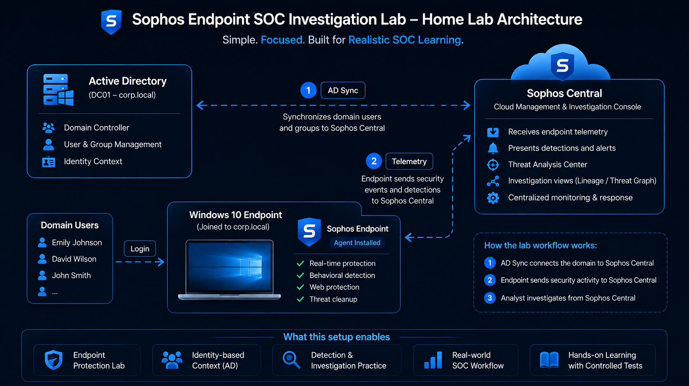
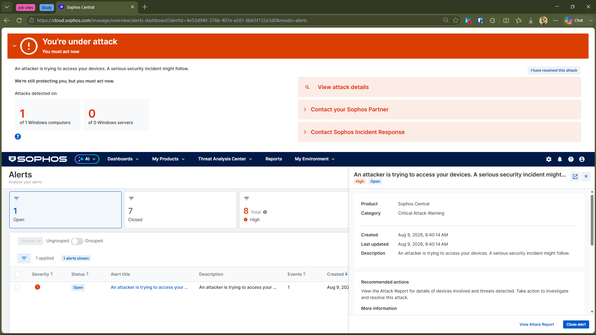
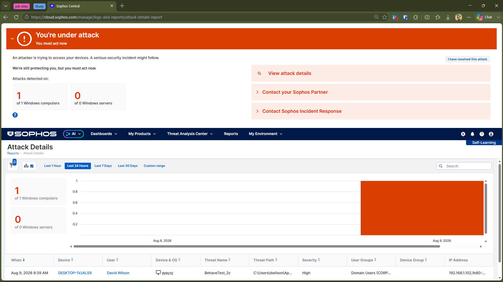

# 🛡️ Sophos Endpoint SOC Investigation Lab

A practical security investigation lab focused on understanding how **Sophos Endpoint and Sophos Central** detect, investigate, and respond to suspicious activity on Windows endpoints.

This project was built to go beyond simply generating detections. The goal was to understand how Sophos connects **endpoint protection, identity context, detection telemetry, investigation, and response** within a centralized security platform.

---

## 🎯 Lab Objective

The objective of this lab was to understand the Sophos security workflow from an analyst's perspective.

Rather than treating Sophos as only an endpoint antivirus product, I explored how its different security capabilities work together during an investigation.

The lab focused on:

- 🔍 Endpoint threat detection
- 🌐 Web protection
- 🧪 Controlled security testing
- 👥 Active Directory identity context
- 📊 Detection investigation
- 🌳 Process Lineage
- 🚨 Alerts and attack-level visibility
- 🧹 Threat remediation
- ☁️ Centralized investigation through Sophos Central

---

## 🏗️ Lab Architecture

---

## 🧪 Investigation Approach

The lab used controlled security test files and scenarios on a Windows 10 endpoint protected by Sophos Endpoint.

The activity was then investigated through Sophos Central to understand what was detected, what telemetry was available, how the endpoint activity could be traced, and how Sophos responded to the activity.

The investigations are documented separately in the repositories below.

---

## 🧠 What I Learned About Sophos

Before this lab, I mainly viewed endpoint security from the perspective of individual detections.

Working with Sophos helped me understand a broader workflow:

**Protection → Detection → Investigation → Response**

Sophos Central acts as the central point where endpoint activity, detections, alerts, investigation data, and response actions can be viewed together.

One of the biggest things I learned was that **a security platform is not just about detecting a file or process**. The investigation context around that activity is equally important to an analyst.

For example, a detection can provide information such as:

- 🖥️ Affected endpoint
- 👤 User associated with the activity
- ⚙️ Process information
- 📁 File information
- 🔗 Parent/child process relationships
- 🔍 Detection rule
- 🧬 Process Lineage
- 🧹 Remediation status

This helped me look at endpoint security more from an **investigation and SOC workflow perspective** rather than simply asking whether something was detected.

---

## 🆚 Sophos vs CrowdStrike Falcon

I had previously worked with **CrowdStrike Falcon**, so using Sophos gave me a useful opportunity to compare how two endpoint security platforms present security activity.

The biggest difference I noticed was not simply whether a threat was detected, but **how the platforms organize and expose the investigation data**.

With Falcon, I explored endpoint detections and investigated activity generated through controlled techniques such as PowerShell, scheduled tasks, and credential-access testing.

With Sophos, I spent more time exploring the relationship between:

**Web Protection → Endpoint Detection → Detection Details → Process Lineage → Remediation**

Sophos also gave me a different perspective on how security platforms separate concepts such as **events, alerts, detections, and cases**.

The experience helped me understand that different EDR/XDR platforms may achieve similar security goals while presenting the investigation workflow differently.

---

## 🔎 Events, Alerts, Detections & Cases

One of the useful concepts I explored during this lab was the difference between several types of security information presented within a security platform.

| Concept | Purpose |
|---|---|
| 📝 **Event** | Individual security activity or telemetry generated by an endpoint |
| 🔔 **Alert** | A notification that something requires attention |
| 🚨 **Detection** | Security activity identified by Sophos as suspicious or malicious |
| 📂 **Case** | A higher-level investigation container used to group related security activity |

These concepts are related, but they are not interchangeable.

An endpoint can generate a large amount of telemetry without every individual event becoming an alert or detection.

A detection represents activity that Sophos has identified as security-relevant, while an alert provides a notification or higher-level indication requiring attention.

Cases provide an additional investigation layer when multiple related security events or detections need to be handled together.

### Why the investigations focused on detections and telemetry

The individual investigations in this project primarily focused on **detections and the telemetry surrounding them**, rather than attempting to document every event generated by the endpoint.

This was intentional.

For a SOC analyst, the useful question is not simply:

> "What happened on the endpoint?"

It is also:

> "What did the security platform identify, what evidence did it provide, and how can I investigate it?"

That distinction became much clearer while working with Sophos Central.

---

## 👥 Identity Context with Active Directory

The lab also included an Active Directory environment with domain users and groups.

Active Directory was synchronized with Sophos Central so that endpoint activity could be viewed alongside organizational identity information.

This added an important SOC perspective:

**Endpoint → User → Detection → Investigation**

Instead of investigating an endpoint as an isolated machine, the analyst can also consider the user associated with the activity.

The synchronized users and groups can be seen in Sophos Central:

This was particularly useful for understanding how endpoint security and identity context can complement each other during an investigation.

---

## 🚨 How Sophos Presents a Larger Attack Scenario

During the lab, I also tested Sophos' **Critical Attack Warning** capability using a controlled security test scenario.

When the test triggered the feature, Sophos Central presented a prominent **"You're under attack"** warning and provided an attack-level view rather than presenting the activity as only an individual endpoint detection.

The corresponding Attack Details view provided additional context about the affected device, user, threat, severity, and other available information.

This was useful for understanding the difference between investigating an individual detection and viewing a broader security incident at the environment level.

---

## 🔍 Investigation Workflow

Across the investigations, I followed a practical SOC-style workflow:

**Test Activity → Protection → Detection → Investigation → Process Context → Remediation**

The exact investigation path varied depending on the type of activity.

For example:

**Web-based Test**

Web Access → Web Protection → Endpoint Detection → Process Lineage → Remediation

**Endpoint Test**

Test File / Activity → Endpoint Detection → Detection Details → Process Lineage → Remediation

The purpose was not simply to trigger a detection, but to investigate the evidence available after the detection occurred.

---

## 📂 Investigation Portfolio

The main project is divided into focused investigations. Each investigation documents a specific security scenario and the evidence collected during the investigation.

### 1️⃣ EICAR Web Protection Investigation

**Focus:** Web Protection, Endpoint Detection and Threat Remediation

A controlled EICAR test was used to observe how Sophos handled a known security test file accessed through the web.

The investigation follows the activity from web access through Sophos protection, detection, investigation telemetry, and remediation.

👉 **[View Investigation 01](./Investigation-01-EICAR-Web-and-Endpoint-Protection/)**

---

### 2️⃣ PUA Detection Investigation

**Focus:** Potentially Unwanted Application Detection and Endpoint Investigation

This investigation explored how Sophos identified a PUA-related test activity and what investigation data was available through Sophos Central.

The investigation also examined Process Lineage and the difference between detection visibility and Threat Graph availability.

👉 **[View Investigation 02](./Investigation-02-PUA-Detection/)**

---

### 3️⃣ DOCM Web Protection & Detection Investigation

**Focus:** Web Protection, Detection Telemetry, Process Lineage and Remediation

A controlled DOCM test scenario was used to observe how Sophos handled web-based access to potentially dangerous test content.

The investigation examined the relationship between Web Protection, Endpoint Detection, Detection Details, Process Lineage, and remediation.

👉 **[View Investigation 03](./Investigation-03-DOCM-Web-Protection-and-Detection/)**

---

## 🌳 Threat Graph Availability

One important observation across the investigations was that **not every Sophos detection generated a Threat Graph**.

Some detections provided detailed investigation information such as detection metadata, process information, and Process Lineage without providing a Threat Graph view.

This was an important distinction during the lab:

**No Threat Graph ≠ No Detection**

The available investigation data depends on the type of detection and the telemetry associated with the event.

Where Process Lineage was available, it was used to understand the process activity surrounding the detection.

---

## 💡 Key Takeaways

This lab changed how I think about endpoint security platforms.

### 🔹 1. Detection is only the beginning

A detection tells an analyst that something security-relevant happened. The investigation requires additional context to understand what happened and whether further action is necessary.

### 🔹 2. Context matters

Process information, user identity, file information, lineage, and endpoint details can make a detection much more useful for investigation.

### 🔹 3. Protection happens at multiple stages

Sophos demonstrated different protection layers during the lab, including Web Protection, Endpoint Protection, detection, and remediation.

### 🔹 4. Different platforms investigate differently

Comparing Sophos with my previous CrowdStrike Falcon lab helped me understand that EDR platforms can provide similar security capabilities while presenting telemetry and investigations in different ways.

### 🔹 5. Identity adds investigation context

Integrating Active Directory helped connect endpoint activity with users and groups instead of viewing the endpoint as an isolated asset.

### 🔹 6. Not every detection has the same investigation views

Process Lineage and Threat Graph availability can differ depending on the detection and available telemetry.

### 🔹 7. SOC analysis is about connecting the evidence

The most valuable part of the lab was learning to connect:

**User + Endpoint + Activity + Detection + Process Context + Response**

rather than looking at an individual security notification in isolation.

---

## 🧠 Conclusion

This project gave me a practical understanding of how Sophos approaches endpoint security and SOC investigations.

Instead of focusing only on whether Sophos could detect a test file, I explored how the platform:

**Protects → Detects → Provides Context → Supports Investigation → Responds**

Working through multiple controlled scenarios also helped me understand the difference between endpoint telemetry, detections, alerts, and broader attack-level visibility.

Most importantly, comparing Sophos with my previous CrowdStrike Falcon work helped me understand that learning an EDR platform is not just about learning where the buttons are. It is about understanding **how the platform represents security activity and how an analyst can use that information to investigate an incident.**

---

## 🛠️ Technologies & Concepts

- 🛡️ Sophos Endpoint
- ☁️ Sophos Central
- 🔍 Threat Analysis Center
- 🌐 Web Protection
- 🚨 Endpoint Detection
- 🌳 Process Lineage
- 📊 Detection Telemetry
- 👥 Active Directory
- 🔄 AD Sync
- 🪟 Windows 10
- 🖥️ Windows Server
- 🧪 Controlled Security Testing
- 🔎 SOC Investigation Workflow
